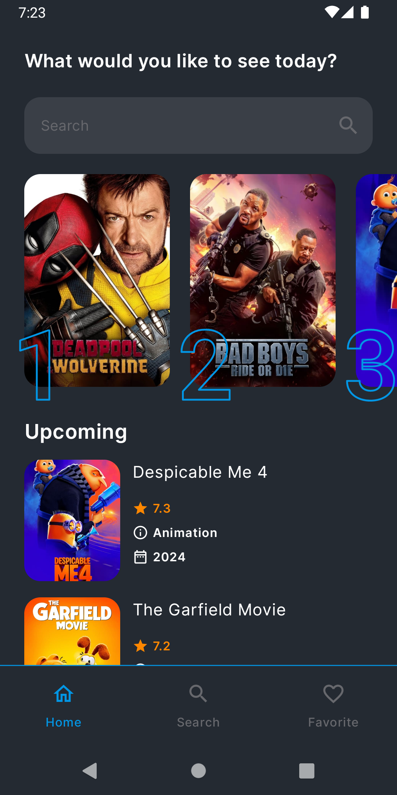
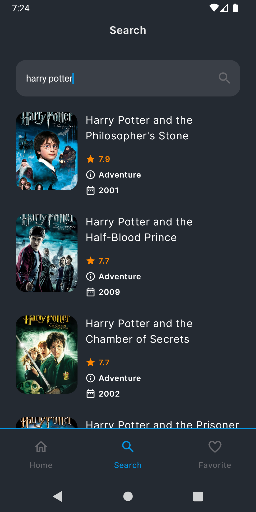
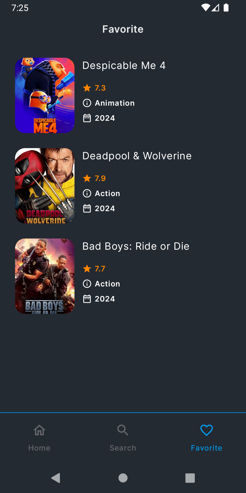
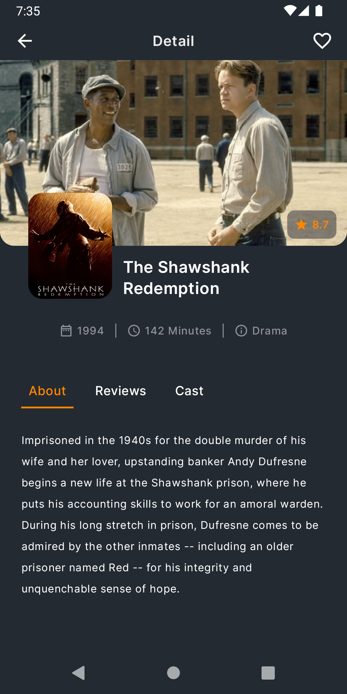
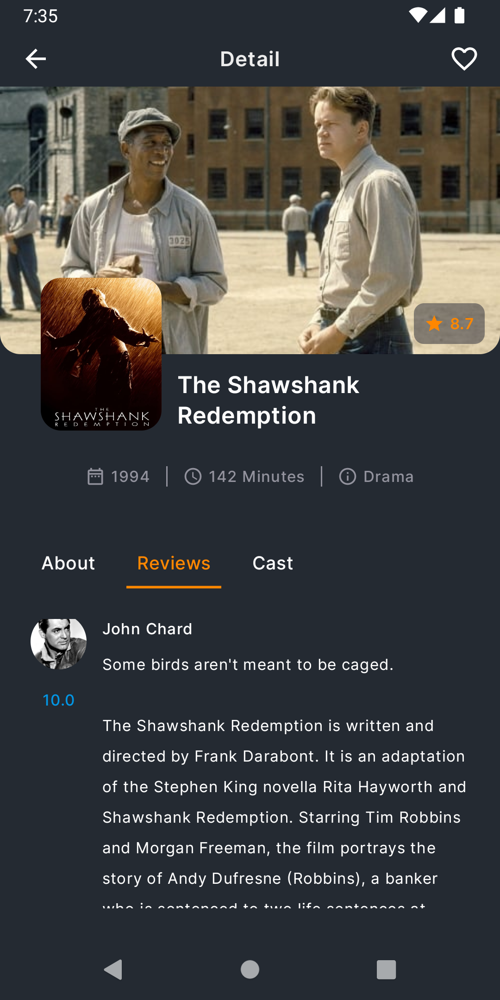
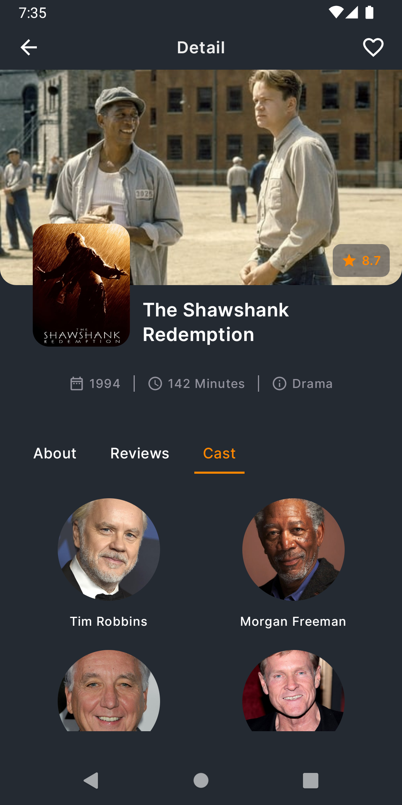

# compose-movie-app
Movie App with Jetpack Compose

## Description
Compose Movie App is a modern Android application built using Jetpack Compose. It showcases a list of movies, allows users to search for their favorite movies, and view detailed information about each movie, including reviews and cast details. The app is designed with a clean and intuitive user interface, leveraging the power of Jetpack Compose for a seamless user experience.

## Tech Stack
- **Kotlin**: Programming language used for Android development.
- **Jetpack Compose**: Modern toolkit for building native Android UI.
- **Retrofit**: Type-safe HTTP client for Android and Java.
- **Coroutines**: For asynchronous programming.
- **Koin**: Dependency Injection library for Android.
- **Room**: Persistence library for local database.
- **Coil**: Image loading library for Android.
- **Clean Architecture**: Architectural pattern to separate concerns and improve testability.

## Screenshots

  
  
  
  
  
  
  

## License

This project is licensed under the MIT License - see the [LICENSE](LICENSE) file for details.

